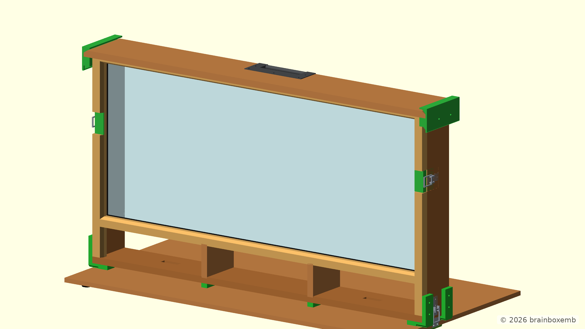
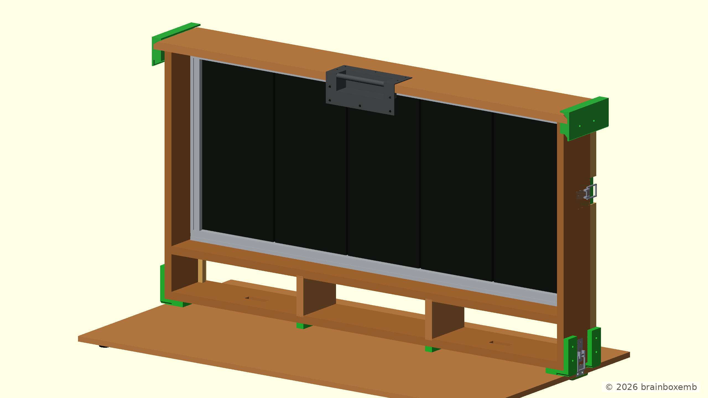
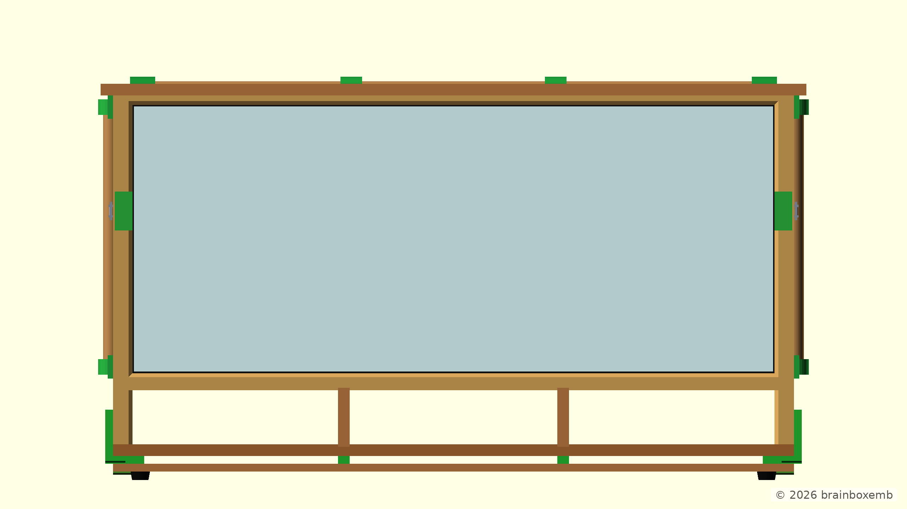
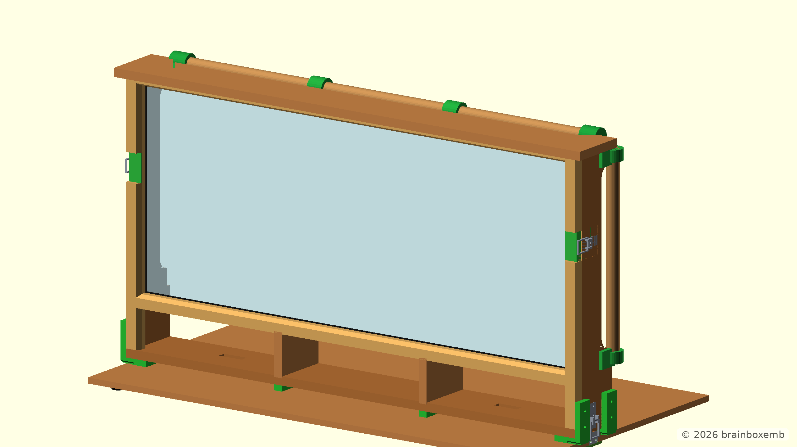
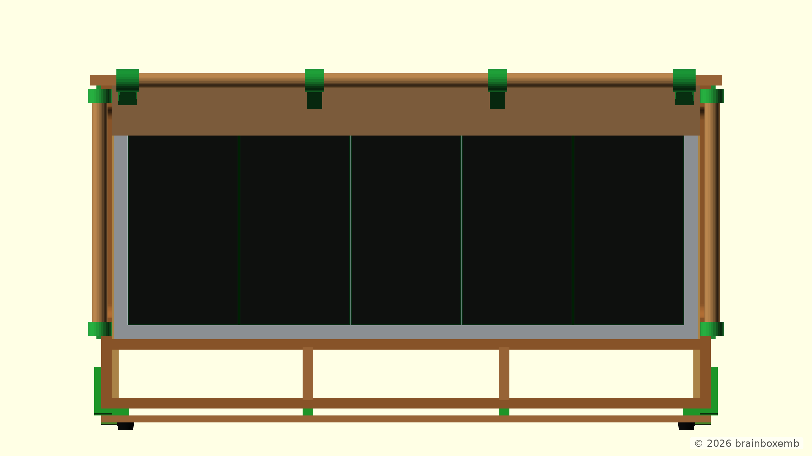
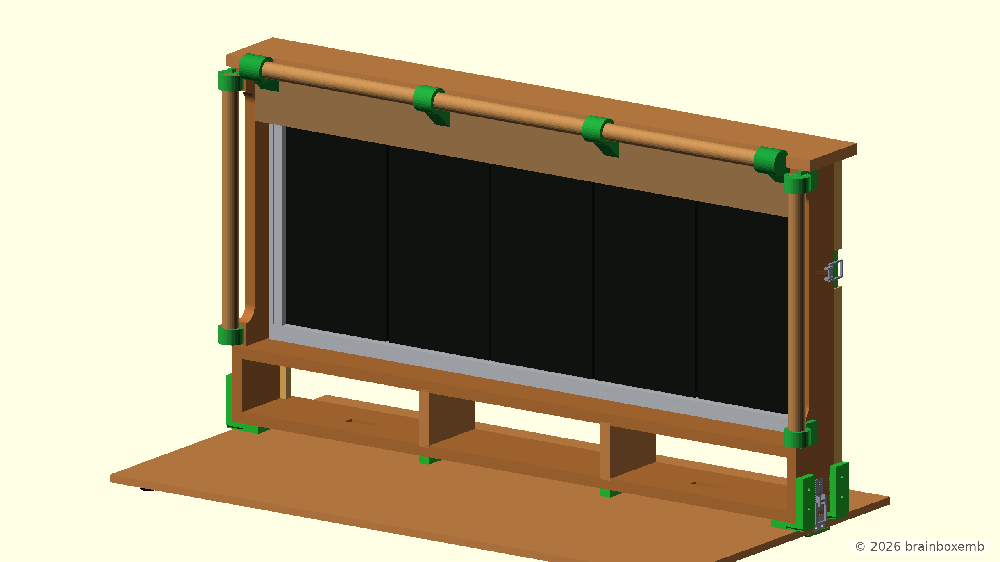
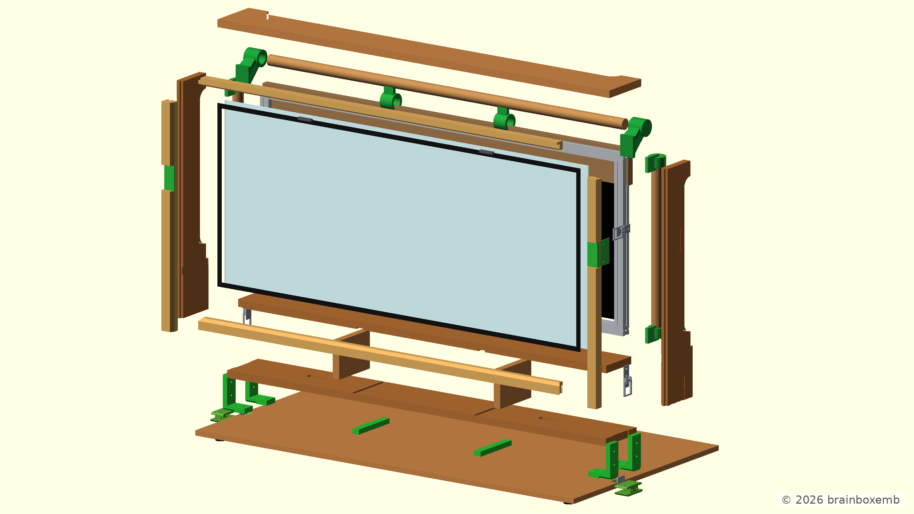
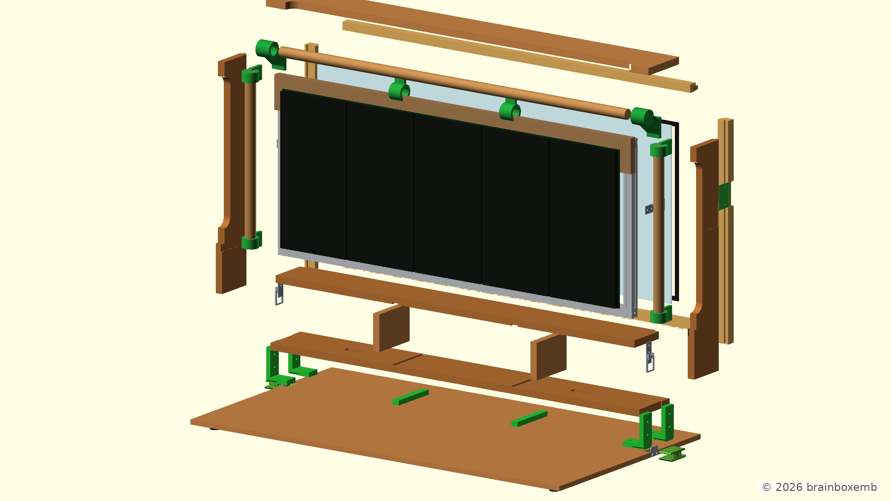

# HUB75 Display Case

> The model and documentation were developed with the assistance of ChatGPT.

This repository contains the OpenSCAD development of a wooden case for a HUB75 LED display. The repository currently contains both the original V1.0 concept and the modularised V1.1 slim-case concept.

The design uses a modular OpenSCAD structure with separate components and assemblies. Individual parts can be opened, rendered and tuned independently, while the complete construction can be viewed from `main.scad`.

> **Project status:** Concept development  
> V1.0 captures the original wooden display-case concept with an internal aluminium HUB75 frame and is mainly retained as a reference design. V1.1 explores a substantially slimmer upper display section combined with an external Ø22 mm roundwood carry structure. Active concept development has moved to V1.1; the printed roundwood interfaces are still conceptual and need further mechanical refinement before fabrication.

## V1.0

### Concept

V1.0 explores a complete wooden display case around the HUB75 display assembly.

The concept includes:

- a 15 mm plywood structural case;
- an oak front trim;
- an acrylic front panel;
- a lower storage compartment;
- a removable front/ground panel;
- an internal aluminium HUB75 subframe;
- HUB75 LED-panel references;
- side clamps and printed clamp interfaces;
- a top handle and corner handle parts;
- printed lower corner brackets;
- rubber-foot references.

V1.0 is still a concept model and is mainly retained as a reference for the original construction approach.

The OpenSCAD model is stored in:

```text
v1.0/cad/
```

### Renders

Reference renders generated from the V1.0 OpenSCAD model are stored in:

```text
v1.0/out/png/
```

#### Front view


#### Front angled view



#### Rear view


#### Rear angled view



#### Exploded front view


#### Exploded rear view


### CAD structure

```text
v1.0/
├── cad/
│   ├── main.scad
│   ├── config/
│   ├── components/
│   ├── assemblies/
│   └── renders/
│       ├── front.scad
│       ├── front_angled.scad
│       ├── rear.scad
│       ├── rear_angled.scad
│       ├── exploded_front.scad
│       └── exploded_rear.scad
└── out/
    └── png/
```

Open `v1.0/cad/main.scad` to view and configure the original concept.

## V1.1

### Concept

V1.1 continues the complete V1.0 display-case design, but changes the upper construction and carry structure.

The lower storage section remains approximately **110 mm deep**, while the upper display section is reduced to approximately **60 mm deep** through the central section. The side walls use 18 mm plywood and retain deeper end zones with 30 mm straight sections and R20 concave transitions toward the slimmer middle section.

The removable top panel follows the same shape language, with deeper end zones and concave R20 transitions toward the 60 mm central section.

The V1.0 front panel, lower storage layout, HUB75 frame, clamps, rear panel, inserts, corner brackets, feet and other applicable configuration options are retained in V1.1.

The V1.0 top-handle construction has been removed from V1.1 and replaced by a visible **Ø22 mm roundwood carry structure** consisting of:

- one vertical roundwood rail at each side;
- one horizontal roundwood rail across the top;
- separate blind printed sockets for the vertical and horizontal rails;
- upper vertical sockets attached to the plywood side walls;
- mirrored lower sockets at the lower end of the upper side walls;
- horizontal sockets attached to an 18 mm plywood cross member below the removable top;
- two additional center supports between the horizontal rail and the cross member.

The removable top is not intended to carry the lifting load. The carry structure transfers its load into the plywood side walls and the upper cross member.

The current V1.1 model deliberately keeps the vertical and horizontal socket modules as separate printed parts. Their exact geometry, fastening and print orientation still need to be refined after the overall construction concept has been validated.

The OpenSCAD model is stored in:

```text
v1.1/cad/
```

### Renders

Reference renders generated from the V1.1 OpenSCAD model are stored in:

```text
v1.1/out/png/
```

#### Front view



#### Front angled view



#### Rear view



#### Rear angled view



#### Exploded front view



#### Exploded rear view



### CAD structure

V1.1 continues to use the modular OpenSCAD structure introduced in V1.0.

```text
v1.1/
├── cad/
│   ├── main.scad
│   ├── config/
│   ├── components/
│   │   ├── roundwood_carry_frame.scad
│   │   └── ...
│   ├── assemblies/
│   │   └── ...
│   └── renders/
│       ├── front.scad
│       ├── front_angled.scad
│       ├── rear.scad
│       ├── rear_angled.scad
│       ├── exploded_front.scad
│       └── exploded_rear.scad
└── out/
    └── png/
```

Open `v1.1/cad/main.scad` to view and configure the complete V1.1 concept.

The Customizer keeps the applicable V1.0 visibility options and adds controls for the roundwood frame, brackets, cross member and center supports. A dedicated `roundwood_structure` view is also available for inspecting the new carry structure separately.

## Automatic renders

The documentation PNG views are generated from the fixed OpenSCAD entry points in the `renders/` directories:

```text
v1.0/cad/renders/
v1.1/cad/renders/
```

The render automation processes these files and writes the generated images to:

```text
v1.0/out/png/
v1.1/out/png/
```

Each documentation view stores its own fixed camera position so the images can be regenerated consistently after model changes.

## Repository structure

```text
.
├── README.md
├── v1.0/
│   ├── cad/
│   │   └── ...
│   └── out/
│       └── png/
└── v1.1/
    ├── cad/
    │   └── ...
    └── out/
        └── png/
```
