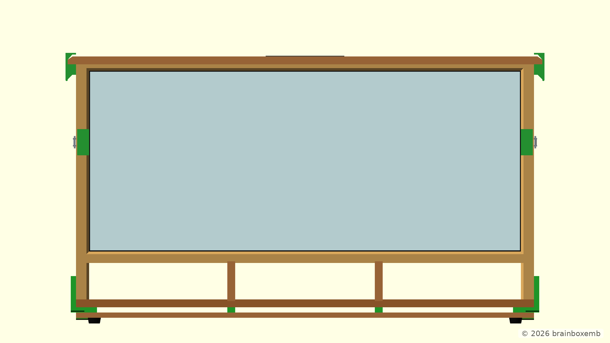
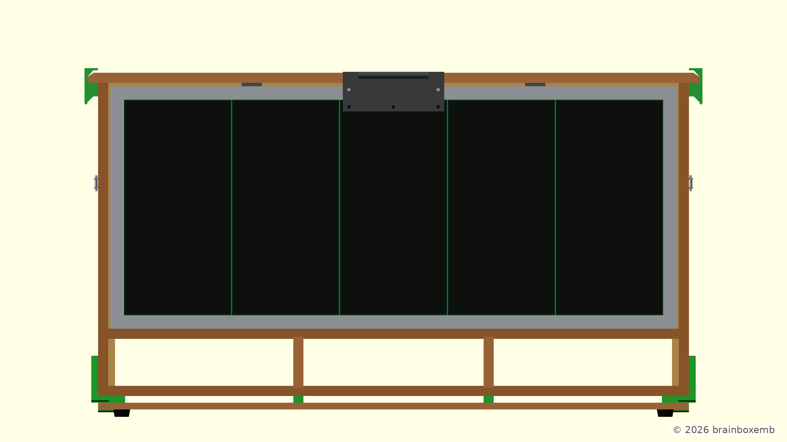
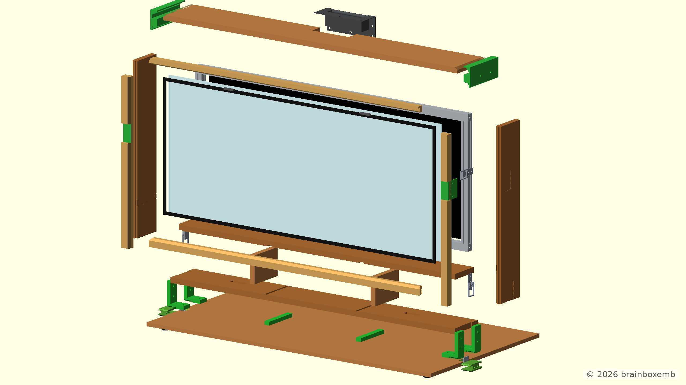
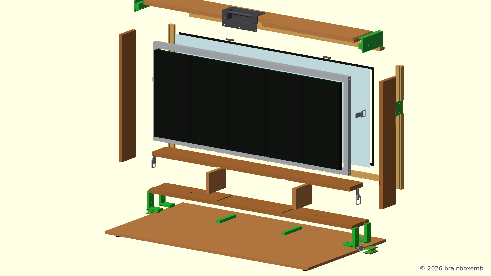

# HUB75 Display Case

> The model and documentation were developed with the assistance of ChatGPT.

This repository contains the OpenSCAD development of a wooden case for a HUB75 LED display.

The design uses a modular OpenSCAD structure with separate components and assemblies. Individual parts can be opened, rendered and tuned independently, while the complete construction can be viewed from `main.scad`.

> **Project status:** Concept development  
> V1.0 captures the original wooden display-case concept with an internal aluminium HUB75 frame and is mainly retained as a reference design. The alternative slim-case concept with an external roundwood carry structure is reserved for V1.1 and will be developed separately.

## V1.0

### Concept

V1.0 explores a complete wooden display case around the HUB75 display assembly.

The concept includes:

- a 15 mm plywood structural case;
- an oak front trim;
- an acrylic front panel;
- a lower storage compartment;
- a removable front/ground panel;
- an internal aluminium HUB75 subframe;
- HUB75 LED-panel references;
- side clamps and printed clamp interfaces;
- a top handle and corner handle parts;
- printed lower corner brackets;
- rubber-foot references.

V1.0 is still a concept model. Dimensions, interfaces and fabrication details should be verified before building the case.

The OpenSCAD model is stored in:

```text
cad/v1.0/
```

### Renders

Reference renders generated from the V1.0 OpenSCAD model are stored in:

```text
out/v1.0/png/
```

The straight views provide a technical reference, while the angled and exploded views make the case depth, internal construction and removable parts easier to inspect.

#### Front view



#### Front angled view


#### Rear view



The rear view is rendered without the removable rear panel so the internal construction remains visible.

#### Rear angled view


#### Exploded front view



#### Exploded rear view



### CAD structure

The V1.0 OpenSCAD model is divided into configuration, individual components and assemblies. Fixed render definitions are included so documentation images can be reproduced locally or by the shared render workflow.

```text
cad/v1.0/
├── main.scad
├── config/
│   └── project_info.scad
├── components/
│   ├── aluminium_frame.scad
│   ├── clamps.scad
│   ├── corner_brackets.scad
│   ├── front_panel.scad
│   ├── front_panel_inserts.scad
│   ├── rear_panel.scad
│   ├── rubber_feet.scad
│   ├── side_clamp_guide.scad
│   ├── top_center_handle.scad
│   ├── top_handles.scad
│   └── wooden_panels.scad
├── assemblies/
│   ├── display_assembly.scad
│   ├── display_case.scad
│   ├── display_case_core.scad
│   └── front_panel_assembly.scad
└── renders/
    ├── front.scad
    ├── front_angled.scad
    ├── rear.scad
    ├── rear_angled.scad
    ├── exploded_front.scad
    └── exploded_rear.scad
```

Open `cad/v1.0/main.scad` to view and configure the complete model.

Files in `components/` can be opened directly in OpenSCAD to inspect and tune individual parts without loading the complete assembly.

Files in `assemblies/` combine these components into functional parts of the complete case and can also be viewed independently.

## V1.1

### Concept

V1.1 is reserved for the alternative slim-case concept explored after V1.0.

That direction reduces the depth of the upper display section and introduces an external Ø22 mm roundwood carry structure. Because this changes both the construction method and the visual design substantially, it is intentionally kept separate from V1.0.

Development of V1.1 will continue later.

## Automatic renders

The documentation PNG views are generated from the fixed OpenSCAD entry points in:

```text
cad/v1.0/renders/
```

The render automation processes these files and writes the generated images to:

```text
out/v1.0/png/
```

The camera position for each documentation view is stored in its corresponding `.scad` file, so the images can be regenerated consistently after model changes.

## Repository structure

```text
.
├── README.md
├── cad/
│   └── v1.0/
│       ├── main.scad
│       ├── config/
│       ├── components/
│       ├── assemblies/
│       └── renders/
└── out/
    └── v1.0/
        └── png/
```
